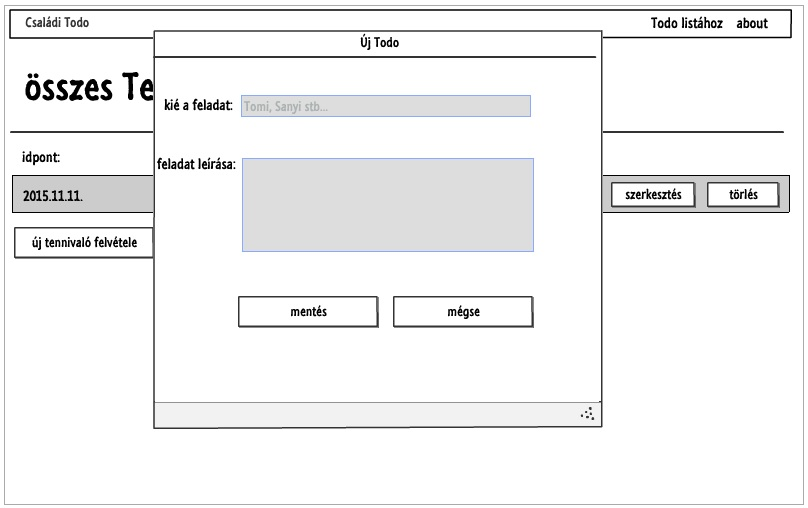
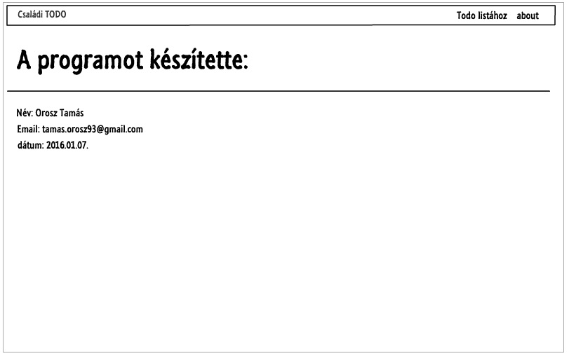

#2. beadandó dokumentációja

##1. Követelmény analízis

**Funkcionális elvárások:**

A webes alkalmazás amit készítünk egy egyszerű családok számára használható TODO (tennivalók kigyűjtése) program. A programnak kell lennie egy lista oldalnak, ahol az összes tennivaló látható. Erről az oldalról lehetőségünk van az egyes tennivalókat megtekinteni, szerkeszteni és törölni, illetve új tennivalókat felvenni. Az új tennivalókat egy felugró ablakban tudjuk felvenni, egy tennivalót szerkeszteni pedig egy külön oldalon. A lista oldalon minden tennivalóhoz tartozik továbbá egy "megtekint" gomb, ami egy kölön oldalon kiírja az adott tennivaló adatait.

**Nem funkcionális követelmények:**

Az alkalmazást vastagkliens alkalmazásként valósítjuk meg ember js segítségével. Az adatbázisunk egy Rest api-t használó távoli adatbázis szerver.

**Szakterületi fogalomjegyzék:**

- todo: Az adatbázisban tárolt tennivalók elnevezése.
- ember js: vastagkliens alkalmazás technológia, a program alapja
- REST API: Representational State Transfer) egy szoftverarchitektúra típus elosztott hipermédia rendszerek számára

**Használati eset modell:**

Szerep körök:

A program todo típusú adatokat tárol egy távoli szerveren amik a program megnyitása után elérhetőek a felhaználók számára. Nincsen egyedi user-ek.

Használati eset diagram:

Egy folyamat ismertetése:

A felhasználó a program használatakor először egy üdvözlő oldalra kerül, innen elérjük az összes TODO-t egy oldalon listázva. Minden TODO-hoz tartozik egy szerkesztés, egy törlés gomb és egy megtekintés gomb. A szerkesztés gombra kattintva értelem szerűen az adott TODO leírása szerkeszthető és az, hogy kinek a feladata az adott TODO. Ha elmentettük a módosításokat akkor visszakerülünk a lista oldalra, ahol már a módosított adatokkal jelenik meg a TODO. Értelem szerűen a törlés gomb törli az adott TODO-t. A megtekintés gomb az adott Todo részleteit mutatja meg (id, Kié a tennivaló, Tennivaló leírása. Megtalálható továbbá még a lista oldalon egy "Új TODO felvétele" gomb, ami egy felugró ablakot nyit ki, ahol egy teljesen új TODO vehető fel. Ha elmentettük, akkor visszakerülünk a lista oldalra. 

##2. Tervezés

**Architecktúra terv:**

Az alkalmazás egy Javascript alapú HTML, ember js, bower, bootstrap technológiákat használó program. A kliensoldali alkalmazás alapját az app mappában lévő router.js (ebben találhatóak az oldal végpontjai) és a végpontokhoz tarozó, a pods mappában tárolt template.hbs, route.js és controller.js file-ok alkotják.

Oldal térkép:

Végpontok:

- todos/list                A listázó oldal
- todos/new                 Az új TODO felvétele oldal
- todos/edit/:todo_id       A TODO szerkesztése oldal
- todos/delete/:todo_id     A TODO törlése oldal
- todos/view/:todo_id       A TOODO megtekintése  

**Felhasználóifelület-modell**

Oldal vázlatok:

Első oldal:

Bejelentkező oldal:

Regisztráció oldal:

Listázó oldal:

Szerkesztő oldal:

Új TODO felvétele oldal:

**Adatmodell**

##3. Implementálás

Fejlesztői környezet:

A fejlesztés a cloud 9 felületén zajlott.

Mappa szerkezet:

- .tmp: itt tároljuk file-ban az adatokat
- config: a waterline configurációját tároljuk itt
- controllers: a végpontok controllerei
- models: az adatbázik modelljét leíró file-ok és a teszt file-ok
- node_modules: a különböző node modulok
- public: bootswatch, bootstrap, jquery
- views: az oldalak megjeneésért felelős hbs file-ok
- images: a dokumentációban használt képek

##4. Tesztelés

Adatmodell tesztelés:

A program adatszerkezetét CHAI-al volt tesztelve.

Emellett funkcionális teszt történt.

##5. Felhasználói dokumentáció

Futtatási követelmények:
- Egy javascript futtatására alkalmas böngésző
- Operációs rendszeres tetszőleges

A program használata a folyamat ismertetés alapján magától értetődik.

# Bead

This README outlines the details of collaborating on this Ember application.
A short introduction of this app could easily go here.

## Prerequisites

You will need the following things properly installed on your computer.

* [Git](http://git-scm.com/)
* [Node.js](http://nodejs.org/) (with NPM)
* [Bower](http://bower.io/)
* [Ember CLI](http://www.ember-cli.com/)
* [PhantomJS](http://phantomjs.org/)

## Installation

* `git clone <repository-url>` this repository
* change into the new directory
* `npm install`
* `bower install`

## Running / Development

* `ember server`
* Visit your app at [http://localhost:4200](http://localhost:4200).

### Code Generators

Make use of the many generators for code, try `ember help generate` for more details

### Running Tests

* `ember test`
* `ember test --server`

### Building

* `ember build` (development)
* `ember build --environment production` (production)

### Deploying

Specify what it takes to deploy your app.

## Further Reading / Useful Links

* [ember.js](http://emberjs.com/)
* [ember-cli](http://www.ember-cli.com/)
* Development Browser Extensions
  * [ember inspector for chrome](https://chrome.google.com/webstore/detail/ember-inspector/bmdblncegkenkacieihfhpjfppoconhi)
  * [ember inspector for firefox](https://addons.mozilla.org/en-US/firefox/addon/ember-inspector/)

